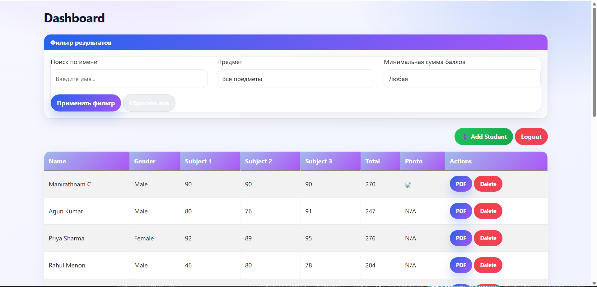

# student-db-management
Edu project: Development of a program for maintaining a database of students' academic performance

# 🎓 Student Performance Management System

## 📌 Description

This project is a web application for managing and storing students' academic performance data.
It allows users to add, view, edit, and delete student records through a simple and intuitive interface.

The application was developed as part of a practical project and demonstrates basic web development skills using Python and Flask.

---

## 🚀 Features

* Add new students
* View list of students
* Edit student information
* Delete records
* Store data in a database

---

## 🛠️ Technologies Used

* Python
* Flask
* HTML
* CSS
* SQLite

---

## 📂 Project Structure

```
student-db-management/
│
├── app.py              # Main Flask application
├── templates/         # HTML templates
├── static/            # CSS and static files
├── database.db        # Database file
```

---

## ▶️ How to Run the Project

1. Clone the repository:

```
git clone https://github.com/SabinaSadreeva/student-db-management.git
```

2. Navigate to the project folder:

```
cd student-db-management
```

3. Install dependencies:

```
pip install flask
```

4. Run the application:

```
python app.py
```

5. Open your browser and go to:

```
http://127.0.0.1:5000
```

---

## 📸 Screenshots



---

## 🎯 Purpose of the Project

The goal of this project is to demonstrate the development of a simple web application using Flask and database integration.

---


